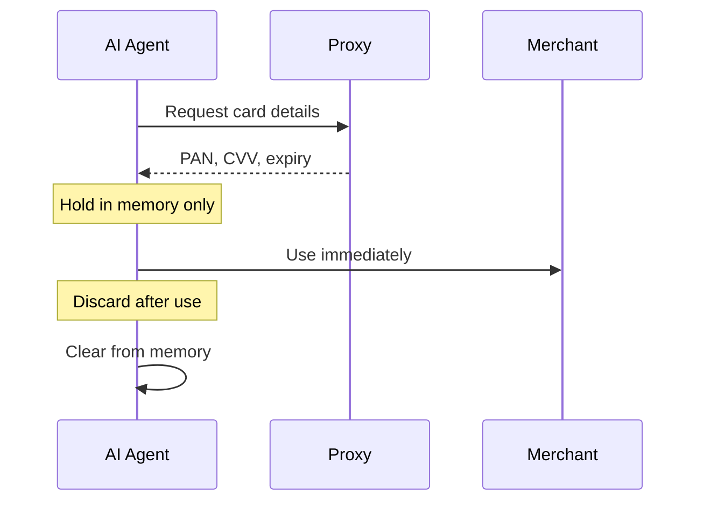

# Best Practices

Follow these guidelines to build a secure and reliable integration with Proxy.

## API Key Security

### Do's and Don'ts

<CardGroup cols={2}>
  <Card title="Do: Use environment variables" icon="check">
    Store API keys in environment variables or secret managers. Never hardcode keys.

    ```bash
    export PROXY_API_KEY="lk_live_xxx"
    ```
  </Card>

  <Card title="Don't: Expose in client code" icon="xmark">
    Never include API keys in frontend JavaScript, mobile apps, or public repositories.

    ```javascript
    // NEVER do this
    const apiKey = "lk_live_xxx";
    ```
  </Card>

  <Card title="Do: Use agent tokens for agents" icon="check">
    Give AI agents their own scoped tokens instead of your master API key.

    ```json
    {
      "PROXY_AGENT_TOKEN": "at_test_xxx"
    }
    ```
  </Card>

  <Card title="Don't: Share keys across environments" icon="xmark">
    Use separate keys for test (`lk_test_`) and live (`lk_live_`).
  </Card>
</CardGroup>

### Key Rotation

Rotate API keys periodically and immediately if compromised:

1. Generate a new key in the dashboard
2. Update your application to use the new key
3. Verify the new key works
4. Revoke the old key

<Warning>
  **If a key is compromised**, revoke it immediately in the dashboard, then rotate to a new key. Monitor recent transactions for unauthorized activity.
</Warning>

---

## Handling Card Credentials

Card credentials (PAN, CVV, expiry) are sensitive. Handle them carefully.

### Do's and Don'ts

<CardGroup cols={2}>
  <Card title="Do: Minimize exposure time" icon="check">
    Request card details only when immediately needed for a transaction. Don't cache them.
  </Card>

  <Card title="Don't: Log card details" icon="xmark">
    Never log full PAN or CVV. At most, log last 4 digits.

    ```javascript
    // Good
    console.log(`Using card ending in ${card.last4}`);

    // Bad - never do this
    console.log(`Card: ${card.pan}, CVV: ${card.cvv}`);
    ```
  </Card>

  <Card title="Do: Use HTTPS only" icon="check">
    All API calls must use HTTPS. Never transmit credentials over HTTP.
  </Card>

  <Card title="Don't: Store credentials" icon="xmark">
    Don't persist card details in databases, files, or caches. Request fresh credentials each time.
  </Card>
</CardGroup>

### Credential Lifecycle



### Browser-Based Agents

If your AI agent runs in a browser context:

- Use Proxy-provided secure iframes (coming soon)
- Never expose credentials to JavaScript you don't control
- Prefer server-side credential handling when possible

---

## Attestation Best Practices

Attestation creates an audit trail linking credential access to stated intent.

### Accurate Attestations

<CardGroup cols={2}>
  <Card title="Do: Be specific" icon="check">
    Provide accurate, specific attestation data.

    ```json
    {
      "summary": "Purchase Sony WH-1000XM5 wireless headphones",
      "expectedAmount": 34999,
      "merchantText": "Amazon.com"
    }
    ```
  </Card>

  <Card title="Don't: Be vague" icon="xmark">
    Avoid generic attestations that don't aid auditing.

    ```json
    {
      "summary": "Buy stuff",
      "expectedAmount": 100000,
      "merchantText": "online"
    }
    ```
  </Card>
</CardGroup>

### Amount Accuracy

- Provide `expectedAmount` as close to actual as possible
- Include taxes and shipping in your estimate
- Proxy allows ~10% variance for intent matching
- Large mismatches trigger risk alerts

### Merchant Text

- Use the merchant name as it appears in card network data
- "Amazon.com" not "Amazon" or "AMZN"
- Check transaction history for exact merchant strings

---

## Intent Best Practices

Intents are required for all cards. Here's how to use them effectively:

### Timing

```
Intent declared → Card details accessed → Transaction occurs
     |                    |                      |
     |<--- 1 hour max --->|<---- 24 hour max --->|
```

- Declare intent close to when you'll use the card
- Access card details shortly after declaring intent
- Complete the transaction within 24 hours of accessing details

### One Intent Per Purchase

<Warning>
  **Each purchase needs a fresh intent**

  Don't reuse intents across multiple purchases. Declare a new intent for each distinct purchase, even if using the same card.
</Warning>

### Intent Data Quality

```javascript
// Good: Specific, accurate
{
  summary: "Order DoorDash delivery - Thai food from Pad Thai Kitchen",
  amount: 4599,
  merchantText: "DOORDASH*PADTHAIKITCH"
}

// Bad: Vague, inaccurate
{
  summary: "food",
  amount: 10000,
  merchantText: "restaurant"
}
```

---

## Webhook Security

### Signature Verification

Always verify webhook signatures:

```javascript
const crypto = require('crypto');

function verifyWebhook(payload, signature, secret) {
  const expected = crypto
    .createHmac('sha256', secret)
    .update(payload)
    .digest('hex');

  return crypto.timingSafeEqual(
    Buffer.from(signature),
    Buffer.from(expected)
  );
}

// In your webhook handler
app.post('/webhooks/proxy', (req, res) => {
  const signature = req.headers['x-proxy-signature'];
  const isValid = verifyWebhook(req.rawBody, signature, webhookSecret);

  if (!isValid) {
    return res.status(401).send('Invalid signature');
  }

  // Process webhook...
  res.status(200).send('OK');
});
```

### Idempotency

Webhooks may be delivered multiple times. Handle them idempotently:

```javascript
const processedEvents = new Set();

function handleWebhook(event) {
  // Check if already processed
  if (processedEvents.has(event.id)) {
    return; // Already handled
  }

  // Process the event
  processEvent(event);

  // Mark as processed
  processedEvents.add(event.id);
}
```

### Respond Quickly

- Return 2xx within 30 seconds
- Process asynchronously if needed
- Failed webhooks are retried with exponential backoff

---

## Agent Lifecycle

### Agent Scope

<CardGroup cols={2}>
  <Card title="Do: Scope agents narrowly" icon="check">
    Register agents with specific, limited purposes.

    ```json
    {
      "name": "travel-booking-agent",
      "description": "Books flights and hotels only",
      "spendingLimit": 200000,
      "spendingLimitFrequency": "perMonth"
    }
    ```
  </Card>

  <Card title="Don't: Create catch-all agents" icon="xmark">
    Avoid overly broad agents with high limits.

    ```json
    {
      "name": "general-agent",
      "description": "Does everything",
      "spendingLimit": 10000000
    }
    ```
  </Card>
</CardGroup>

### Agent Tokens

- Generate agent tokens for AI agents
- Agent tokens can only access agent-scoped tools
- Rotate tokens periodically
- Revoke tokens when agents are decommissioned

### Deregistration

When an agent is no longer needed:

1. Close all active cards for the agent
2. Deregister the agent via API
3. Revoke any agent tokens
4. Remove from your systems

---

## Card Lifecycle

### Card Types

| Scenario | Card Type | Why |
|----------|-----------|-----|
| One-time purchase | `single` | Auto-closes, limits exposure |
| Recurring purchases | `multi` | Reusable with velocity limits |
| Unknown usage pattern | `single` | Safer default |

### Card Limits

Set appropriate limits:

```javascript
// Per-transaction limit (required for single-use)
{ "maxAmount": 10000 }  // $100 max

// For multi-use cards, also consider
{
  "policy": {
    "maxAmount": 50000,        // Per-transaction: $500
    "dailyLimit": 100000,      // Daily: $1000
    "monthlyLimit": 500000     // Monthly: $5000
  }
}
```

### Close Unused Cards

- Close cards that won't be used
- Single-use cards auto-close after settlement
- Regularly audit and close stale multi-use cards

---

## Error Handling

### Graceful Degradation

```javascript
async function createCardAndGetDetails(agentId, purpose, amount) {
  try {
    const card = await createCard(agentId, { purpose, maxAmount: amount });
    const details = await getCardDetails(card.id);
    return details;
  } catch (error) {
    if (error.code === 'INSUFFICIENT_BALANCE') {
      // Notify user to add funds
      notifyUserLowBalance();
      throw new UserActionRequired('Please add funds');
    }
    if (error.code === 'RATE_LIMITED') {
      // Retry with backoff
      await sleep(error.retryAfter);
      return createCardAndGetDetails(agentId, purpose, amount);
    }
    // Log and rethrow unexpected errors
    logger.error('Unexpected error', error);
    throw error;
  }
}
```

### Retry Strategy

| Error Type | Retry? | Strategy |
|------------|--------|----------|
| Rate limited (429) | Yes | Exponential backoff |
| Server error (5xx) | Yes | 3 retries, backoff |
| Auth error (401) | No | Check credentials |
| Validation error (400) | No | Fix request |
| Insufficient funds | No | User action needed |

---

## Monitoring

### What to Monitor

- API error rates and latency
- Transaction approval rates
- Intent match rates
- Webhook delivery success
- Agent spending vs limits

### Alerts to Set Up

- High transaction decline rate
- Webhook delivery failures
- Agent approaching spending limit
- Unusual transaction patterns
- API errors spike

---

## Next Steps

<CardGroup cols={2}>
  <Card title="Troubleshooting" icon="wrench" href="/troubleshooting">
    Common issues and solutions
  </Card>

  <Card title="Risk Policies" icon="shield-exclamation" href="/concepts/risk-policies">
    Configure anomaly detection
  </Card>

  <Card title="Webhooks Setup" icon="bell" href="/webhooks/setup">
    Implement webhook handling
  </Card>

  <Card title="API Reference" icon="code" href="/api-reference/introduction">
    Complete API documentation
  </Card>
</CardGroup>
