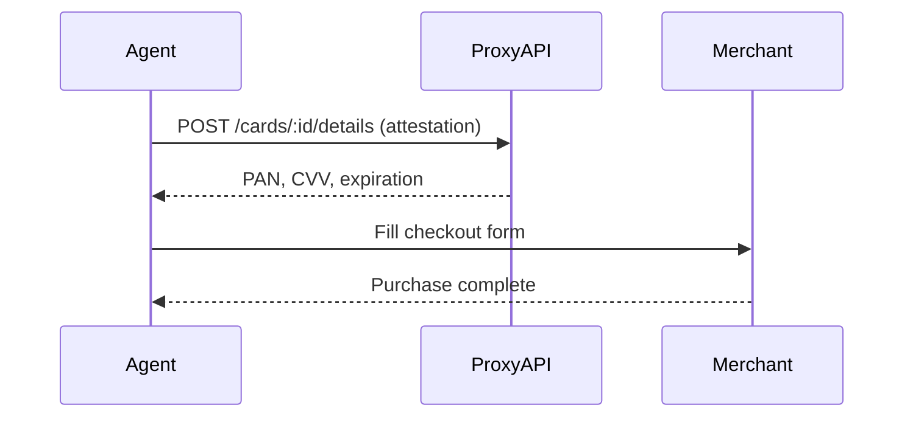

# Security & Attestation

Proxy is designed for AI agents that spend real money. This guide covers the security model that makes this safe.

## The Problem with AI + Payments

When AI agents can spend money, you need answers to:
- **What did the agent claim it was doing?** (audit trail)
- **Did the transaction match the claim?** (verification)
- **Who accessed the card credentials?** (accountability)
- **Can we limit blast radius?** (controls)

Proxy addresses these with **attestation**, **intents**, and **velocity limits**.

## Attestation Model

Proxy uses an **attestation-before-access** model. Before retrieving card credentials, your agent must attest what it intends to do with the card. This creates an audit trail and enables automatic policy enforcement.



## Retrieving Credentials

Request credentials by providing an attestation:

```bash
curl -X POST https://api.useproxy.ai/v1/cards/$CARD_ID/details \
  -H "Api-Key: $API_KEY" \
  -H "Content-Type: application/json" \
  -d '{
    "summary": "Order dinner on DoorDash",
    "expectedAmount": 2500,
    "merchantText": "DoorDash"
  }'
```

**Response:**
```json
{
  "accessEventId": "evt_abc123",
  "pan": "4111111111111111",
  "cvv": "123",
  "expirationMonth": "12",
  "expirationYear": "2025",
  "last4": "1111"
}
```

The `accessEventId` links this credential access to your attestation for audit purposes.

## Credential Access

When you call `POST /v1/cards/{cardId}/details` with a valid attestation, the API returns the full card credentials (PAN, CVV, expiration) directly in the response. This allows your AI agent to use the card details for payments.

## Attestation Payload

The attestation payload describes the intended use:

| Field | Type | Required | Description |
|-------|------|----------|-------------|
| `summary` | string | Yes | Human-readable description of intent |
| `expectedAmount` | number | No | Expected transaction amount in cents |
| `expectedCurrency` | string | No | Currency code (default: USD) |
| `merchantText` | string | No | Expected merchant name |
| `reason` | string | No | `one-time`, `subscription`, `preauth` |
| `clientContext` | object | No | Custom metadata for your records |

**Example with full attestation:**
```json
{
  "summary": "Subscribe to Netflix Standard plan",
  "expectedAmount": 1549,
  "expectedCurrency": "USD",
  "merchantText": "Netflix",
  "reason": "subscription",
  "clientContext": {
    "sessionId": "sess_123",
    "toolName": "subscription-agent",
    "userRequest": "Set up Netflix subscription"
  }
}
```

## Transaction Correlation

When a transaction occurs, it's automatically correlated with recent credential access events:

| Status | Meaning |
|--------|---------|
| `attested` | Credential access found within the attestation window |
| `unattested` | No recent credential access found |
| `stale` | Credential access found but outside the window |

The default attestation window is 10 minutes. Configure via `attestationWindowMinutes` when creating the card (1-60 minutes).

## Rate Limits

- Maximum 10 credential retrievals per hour per card

## Layered Security Model

Proxy provides multiple layers of protection:

| Layer | What it does | Example |
|-------|--------------|---------|
| **Attestation** | Records what agent claimed | "Ordering lunch on DoorDash for $25" |
| **Intents** | Matches transactions to claims | Transaction $24.50 at DoorDash → matched |
| **Velocity limits** | Caps spending rates | $50/transaction, $200/day, $500/month |
| **Risk engine** | Detects anomalies | Merchant drift, spend spikes, duplicates |
| **Time controls** | Restricts when card works | Only active 9am-5pm weekdays |

**For maximum security, use all layers together:**

```json
{
  "purpose": "DoorDash lunch orders",
  "type": "multi",
  "limits": {
    "perAuth": 5000,
    "perMonth": 50000
  },
  "requireAttestation": true,
  "activeHoursStart": 11,
  "activeHoursEnd": 14,
  "activeTimezone": "America/New_York",
  "activeDays": [1, 2, 3, 4, 5]
}
```

This card:
- Max $50/transaction, $500/month (via `limits` object)
- Requires attestation before each use
- Only works 11am-2pm Mon-Fri Eastern
- Risk engine can alert on merchant drift if enabled

## Best Practices

<AccordionGroup>
  <Accordion title="Always provide detailed attestations">
    Include expected amount, merchant, and reason. This helps with audit trails and fraud detection.
  </Accordion>
  <Accordion title="Secure your API keys">
    Never expose API keys in client-side code. All credential access should happen server-side.
  </Accordion>
  <Accordion title="Monitor unattested transactions">
    Set up webhook handlers for `spend.unattested` events to detect anomalies.
  </Accordion>
  <Accordion title="Use single-use cards for unknown purchases">
    For one-off purchases, create single-use cards that auto-close after the transaction completes.
  </Accordion>
  <Accordion title="Use single-use cards for unknown merchants">
    When an agent needs to buy from a new merchant, use a single-use card that auto-closes after the transaction.
  </Accordion>
  <Accordion title="Set up alerts for mismatched intents">
    Subscribe to `intent.mismatched` webhooks to catch when transactions deviate significantly from declared intent.
  </Accordion>
</AccordionGroup>

## Related

<CardGroup cols={2}>
  <Card title="Spending Intents" icon="bullseye" href="/concepts/spending-intents">
    Pre-transaction declarations for audit trails
  </Card>
  <Card title="Cards" icon="credit-card" href="/concepts/cards">
    Card types and velocity limits
  </Card>
</CardGroup>
