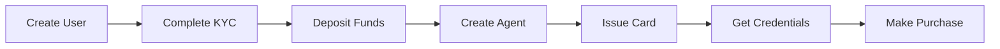

# Create Your First Card

This guide walks you through the complete flow of issuing a virtual card.

## Prerequisites

- API key from the [Dashboard](https://dashboard.useproxy.ai)
- A user with approved KYC status
- Funds deposited

## The Flow



## Step 1: Create a User

If you don't have an approved user yet:

```bash
# First create the user
curl -X POST https://api.useproxy.ai/v1/users \
  -H "Api-Key: $API_KEY" \
  -H "Content-Type: application/json" \
  -d '{
    "firstName": "John",
    "lastName": "Doe",
    "email": "john@example.com"
  }'

# Then initiate KYC verification
curl -X POST https://api.useproxy.ai/v1/verification/user \
  -H "Api-Key: $API_KEY" \
  -H "Content-Type: application/json" \
  -d '{"userId": "'$USER_ID'"}'
```

The user must complete KYC via the `verificationUrl` returned in the response.

## Step 2: Check User Status

```bash
curl https://api.useproxy.ai/v1/users/$USER_ID \
  -H "Api-Key: $API_KEY"
```

Wait until `applicationStatus` is `approved`.

## Step 3: Deposit Funds

Get the funding methods:

```bash
curl https://api.useproxy.ai/v1/users/$USER_ID/funding \
  -H "Api-Key: $API_KEY"
```

Send USDC to the `address` on your preferred chain.

## Step 4: Check Balance

```bash
curl https://api.useproxy.ai/v1/balances/$USER_ID \
  -H "Api-Key: $API_KEY"
```

Verify `available` is greater than 0.

## Step 5: Register an Agent

```bash
curl -X POST https://api.useproxy.ai/v1/agents/register \
  -H "Api-Key: $API_KEY" \
  -H "Content-Type: application/json" \
  -d '{
    "externalId": "my-first-agent",
    "userId": "'$USER_ID'",
    "name": "My First Agent"
  }'
```

Save the `id` as `$AGENT_ID`.

## Step 6: Issue a Card

```bash
curl -X POST https://api.useproxy.ai/v1/agents/$AGENT_ID/cards \
  -H "Api-Key: $API_KEY" \
  -H "Content-Type: application/json" \
  -d '{
    "purpose": "Test purchase",
    "type": "single",
    "maxAmount": 5000
  }'
```

Save the `id` as `$CARD_ID`.

## Step 7: Get Card Credentials

```bash
curl -X POST https://api.useproxy.ai/v1/cards/$CARD_ID/details \
  -H "Api-Key: $API_KEY" \
  -H "Content-Type: application/json" \
  -d '{
    "summary": "Test purchase",
    "expectedAmount": 1000
  }'
```

Use the returned credentials to make a purchase.

<Note>
In sandbox, card credentials are test-only. Proxy returns mock PAN/CVV (for example, `4242...` numbers) that cannot be used for real purchases.
</Note>

## What's Next?

<CardGroup cols={2}>
  <Card title="Card Types" href="/concepts/cards">
    Learn about single vs multi cards
  </Card>
  <Card title="Security & Attestation" href="/concepts/security-attestation">
    Understand attestation and security
  </Card>
</CardGroup>
