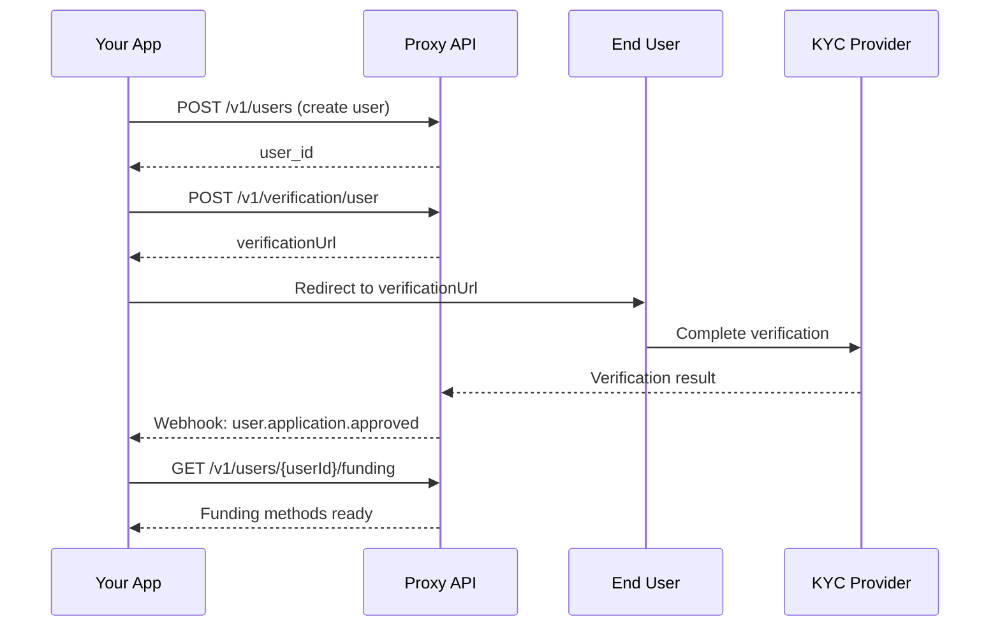

# Onboarding & Verification

Proxy requires two levels of verification:

| Verification | Who | Required For |
|--------------|-----|--------------|
| **KYB** (Know Your Business) | Your organization | Live API keys, production transactions |
| **KYC** (Know Your Customer) | Your end users | Deposits, cards, transactions |

<Warning>
**Both KYB and KYC are required for production.** KYB must be completed before you can access live API keys. KYC must be completed for each user before they can transact.
</Warning>

---

## KYB (Business Verification)

KYB verifies your organization's identity and legitimacy. This is required to access live API keys and process real transactions.

### KYB Timeline

| Stage | Typical Duration |
|-------|------------------|
| **Business info submission** | 10-15 minutes |
| **Document upload** | 5-10 minutes |
| **Beneficial owner verification** | 5-10 minutes per owner |
| **Review** | 1-3 business days |
| **Live keys available** | Immediately after approval |

### KYB Requirements

| Category | Required Information |
|----------|---------------------|
| **Business Details** | Legal name, DBA (if any), EIN, business type |
| **Address** | Registered business address |
| **Incorporation** | State/country, date of incorporation |
| **Documents** | Certificate of Incorporation, EIN Letter |
| **Beneficial Owners** | All individuals with 25%+ ownership |

### KYB Statuses

| Status | Meaning | Next Step |
|--------|---------|-----------|
| `not_started` | KYB not begun | Complete business info in Dashboard |
| `pending_info` | Business info incomplete | Fill in remaining fields |
| `pending_documents` | Documents needed | Upload required documents |
| `pending_verification` | UBO verification needed | Beneficial owners must verify identity |
| `under_review` | Submitted, awaiting review | Wait (1-3 business days) |
| `approved` | Verified | Live API keys available |
| `denied` | Verification failed | Contact support |

### Completing KYB

KYB is completed through the Dashboard at **Settings > Verification**:

<Steps>
  <Step title="Business Information">
    Enter your legal business name, EIN, business type, and registered address.
  </Step>
  <Step title="Upload Documents">
    Upload Certificate of Incorporation, EIN Letter, and proof of address.
  </Step>
  <Step title="Add Beneficial Owners">
    Add all individuals who own 25% or more of the business.
  </Step>
  <Step title="Owner Verification">
    Each beneficial owner receives an email to complete identity verification.
  </Step>
  <Step title="Submit for Review">
    Once all owners are verified, submit your application.
  </Step>
</Steps>

### KYB API Endpoints

You can also manage KYB programmatically:

```bash
# Get current KYB status
curl https://api.useproxy.ai/v1/verification/business \
  -H "Api-Key: $API_KEY"

# Update business information
curl -X PATCH https://api.useproxy.ai/v1/verification/business \
  -H "Api-Key: $API_KEY" \
  -H "Content-Type: application/json" \
  -d '{
    "legal_name": "Acme Corp",
    "ein": "12-3456789",
    "business_type": "llc"
  }'

# Add beneficial owner
curl -X POST https://api.useproxy.ai/v1/verification/business/owners \
  -H "Api-Key: $API_KEY" \
  -H "Content-Type: application/json" \
  -d '{
    "first_name": "John",
    "last_name": "Doe",
    "email": "john@acme.com",
    "ownership_percentage": 50
  }'
```

### KYB Webhooks

Subscribe to KYB webhooks to track verification progress:

```javascript
app.post('/webhooks', (req, res) => {
  const event = req.body;

  switch (event.type) {
    case 'kyb.submitted':
      console.log('KYB application submitted for review');
      break;

    case 'kyb.approved':
      // Organization verified! Live keys now available
      await enableLiveMode(event.data.organizationId);
      break;

    case 'kyb.denied':
      await notifyKybDenied(event.data.organizationId, event.data.reason);
      break;

    case 'kyb.owner_verified':
      // A beneficial owner completed verification
      console.log(`Owner ${event.data.ownerId} verified`);
      break;
  }

  res.status(200).send('OK');
});
```

<Info>
**Sandbox Access:** You can use sandbox API keys (`lk_test_*`) immediately without KYB. KYB is only required for live API keys (`lk_live_*`).
</Info>

---

## KYC (User Verification)

KYC verifies the identity of your end users. Every user must complete KYC before they can deposit funds or use cards.

### KYC Overview

Every User must complete Know Your Customer (KYC) verification before they can:
- Deposit funds
- Have agents issue cards
- Make transactions

This is a regulatory requirement for card issuing and cannot be bypassed.

## KYC Timeline

| Stage | Typical Duration |
|-------|------------------|
| **User creation** | Instant |
| **KYC initiation** | Instant (returns verification URL) |
| **User completes KYC** | 5-10 minutes (user action) |
| **Automated approval** | 1-5 minutes |
| **Manual review** (if flagged) | 1-2 business days |
| **Ready to deposit** | Immediately after approval |

<Tip>
**Best practice:** Initiate KYC as early as possible in your user flow. Don't wait until the user wants to make their first purchase.
</Tip>

## Required Information

The KYC process collects:

| Category | Required Fields |
|----------|-----------------|
| **Identity** | Full legal name, date of birth |
| **Contact** | Email, phone number |
| **Address** | Street address, city, state, postal code, country |
| **Tax ID** | SSN (US) or equivalent for other countries |
| **Documents** | Government-issued ID (passport, driver's license) |

<Note>
Additional documents (proof of address, selfie) may be requested if automated verification fails.
</Note>

## Integration Flow



## Step 1: Create a User

```bash
curl -X POST https://api.useproxy.ai/v1/users \
  -H "Api-Key: $API_KEY" \
  -H "Content-Type: application/json" \
  -d '{
    "firstName": "John",
    "lastName": "Doe",
    "email": "john@example.com"
  }'
```

## Step 2: Initiate KYC

```bash
curl -X POST https://api.useproxy.ai/v1/verification/user \
  -H "Api-Key: $API_KEY" \
  -H "Content-Type: application/json" \
  -d '{
    "userId": "user_abc123"
  }'
```

**Response:**
```json
{
  "object": "verification",
  "userId": "user_abc123",
  "applicationStatus": "pending",
  "verificationUrl": "https://kyc.useproxy.ai/verify/xyz789"
}
```

## Step 3: User Completes Verification

Redirect the user to `verificationUrl`. They'll complete the KYC flow which includes:

1. Personal information form
2. Government ID upload
3. Selfie verification (liveness check)
4. Address verification

## Step 4: Handle Webhooks

Subscribe to KYC status webhooks to react to verification results:

```javascript
app.post('/webhooks', (req, res) => {
  const event = req.body;

  switch (event.type) {
    case 'user.application.approved':
      // User is ready! Enable deposits and card creation
      await enableUserFeatures(event.data.userId);
      break;

    case 'user.application.denied':
      // Verification failed
      await notifyUserDenied(event.data.userId, event.data.reason);
      break;

    case 'user.application.needs_info':
      // Additional documents needed
      await requestAdditionalDocs(event.data.userId, event.data.requiredFields);
      break;
  }

  res.status(200).send('OK');
});
```

<Tip>
See the [KYB Webhooks](#kyb-webhooks) section above for business verification webhook handling.
</Tip>

## Application Statuses

| Status | Meaning | Next Step |
|--------|---------|-----------|
| `notStarted` | KYC not initiated | Call `POST /v1/verification/user` |
| `pending` | User is completing verification | Wait for webhook |
| `needsInformation` | Additional docs required | User must upload more documents |
| `needsVerification` | Re-verification required | User must complete verification again |
| `manualReview` | Under manual review | Wait (1-2 business days) |
| `approved` | Ready to use | User can deposit and transact |
| `denied` | Verification failed | Cannot proceed |
| `locked` | Account locked | Contact support |

## Handling Edge Cases

### User Abandons KYC

If a user doesn't complete verification, you can:

1. **Resend the verification URL** — The same URL remains valid
2. **Check status** — `GET /v1/verification/user/{userId}`
3. **Send reminders** — Implement your own reminder flow

### Additional Documents Needed

When status is `needsInformation`:

```bash
# Check what's needed
curl https://api.useproxy.ai/v1/verification/user/$USER_ID \
  -H "Api-Key: $API_KEY"

# Response includes requiredFields
{
  "applicationStatus": "needsInformation",
  "requiredFields": ["proofOfAddress", "governmentIdBack"]
}
```

Upload documents:

```bash
curl -X PUT https://api.useproxy.ai/v1/verification/user/$USER_ID/document \
  -H "Api-Key: $API_KEY" \
  -H "Content-Type: multipart/form-data" \
  -F "documentType=proofOfAddress" \
  -F "file=@/path/to/document.pdf"
```

### KYC Denied

If verification is denied, the user cannot use Proxy. Common denial reasons:

- Identity could not be verified
- Document appears fraudulent
- Sanctions list match
- High-risk jurisdiction

<Warning>
Denied users cannot retry KYC. They must contact support to appeal.
</Warning>

## Best Practices

<AccordionGroup>
  <Accordion title="Start KYC early">
    Don't wait until the user wants to spend. Initiate KYC during signup or onboarding to minimize friction later.
  </Accordion>
  <Accordion title="Set expectations">
    Tell users upfront that identity verification is required. This reduces drop-off and support tickets.
  </Accordion>
  <Accordion title="Use webhooks, not polling">
    Subscribe to `user.application.*` webhooks instead of polling the status endpoint.
  </Accordion>
  <Accordion title="Handle manual review gracefully">
    Some users will be flagged for manual review. Display appropriate messaging ("verification in progress") rather than leaving them confused.
  </Accordion>
  <Accordion title="Test in sandbox">
    Use test users in sandbox to verify your KYC flow end-to-end. By default, KYC can auto-approve when using `lk_test_` keys. Set `PROXY_TEST_KYC_AUTO_APPROVE=false` if you want to keep KYC pending and exercise your retry flows.
  </Accordion>
</AccordionGroup>

## Related

<CardGroup cols={2}>
  <Card title="Users" icon="user" href="/concepts/users">
    User lifecycle and management
  </Card>
  <Card title="Deposits & Withdrawals" icon="wallet" href="/guides/deposits-withdrawals">
    Fund user accounts after KYC approval
  </Card>
  <Card title="KYB API Reference" icon="building" href="/api-reference/introduction">
    Business verification API endpoints
  </Card>
  <Card title="Webhook Events" icon="bell" href="/webhooks/events">
    KYB and KYC webhook event payloads
  </Card>
</CardGroup>
