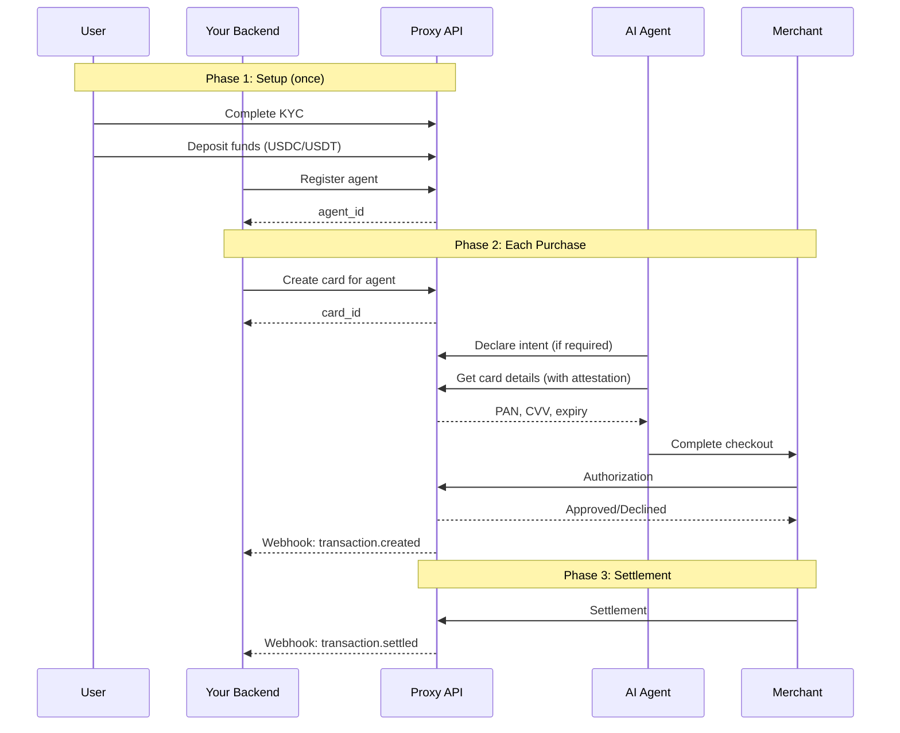
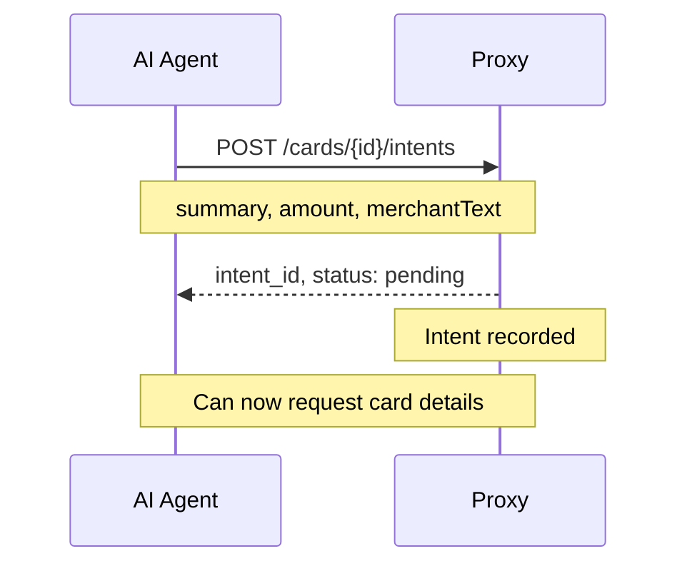
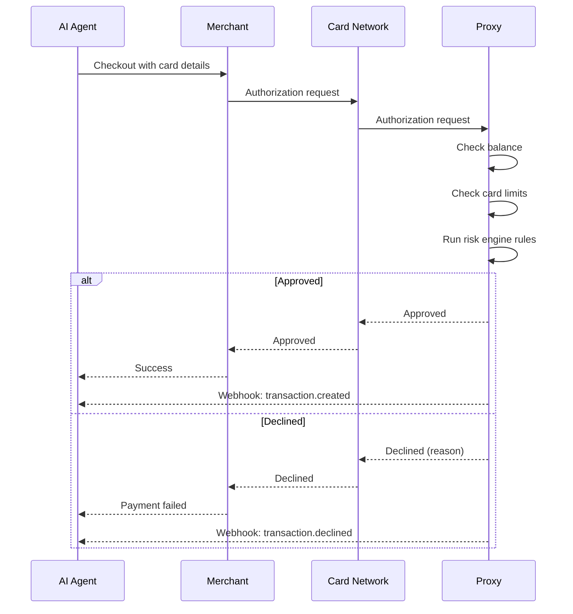
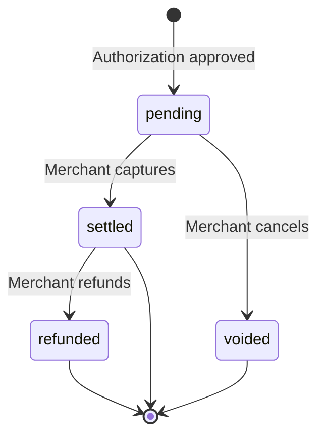
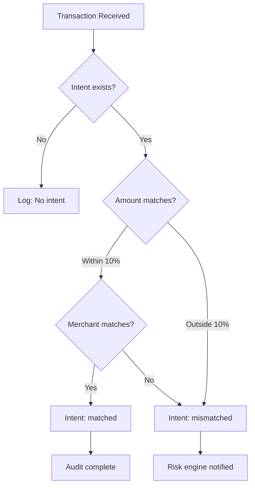
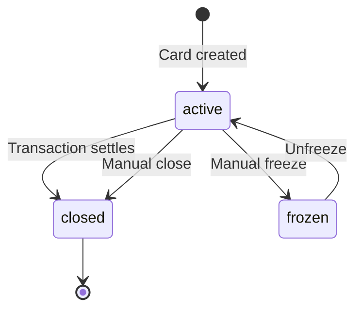
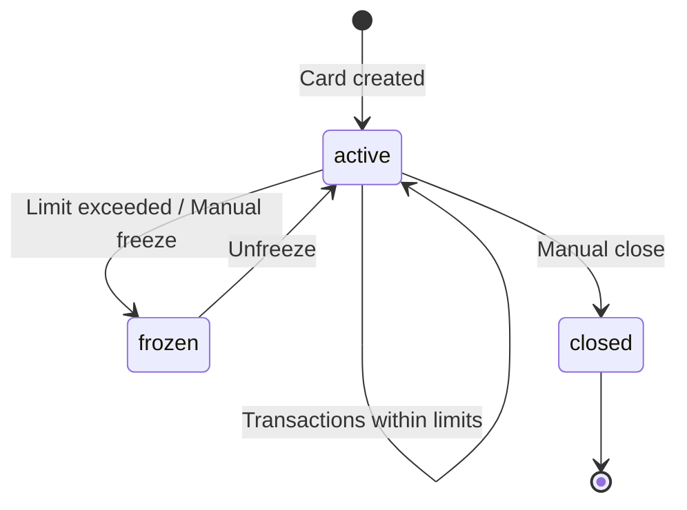

# Payment Flow

Complete payment lifecycle from funding to transaction settlement.

## Overview

The Proxy payment system follows a secure flow:



## Phase 1: Setup

### User Onboarding

Before any spending can happen, you need a verified, funded user:

<Steps>
  <Step title="Create User">
    ```bash
    curl -X POST https://api.useproxy.ai/v1/users \
      -H "Api-Key: lk_live_xxx" \
      -d '{"firstName": "John", "lastName": "Doe", "email": "john@example.com"}'
    ```
    Returns: `user_id`
  </Step>

  <Step title="Initiate KYC">
    ```bash
    curl -X POST https://api.useproxy.ai/v1/verification/user \
      -H "Api-Key: lk_live_xxx" \
      -d '{"userId": "user_xxx"}'
    ```
    Returns: `verificationUrl` - send this to your user
  </Step>

  <Step title="User Completes KYC">
    User visits the verification URL and completes identity verification.
    You receive webhook: `user.approved` when complete.
  </Step>

  <Step title="User Deposits Funds">
    ```bash
    curl https://api.useproxy.ai/v1/users/user_xxx/funding \
      -H "Api-Key: lk_live_xxx"
    ```
    Returns deposit addresses for USDC/USDT. User sends crypto.
    You receive webhook: `deposit.completed` when funds are credited.
  </Step>
</Steps>

### Agent Creation

Once a user is funded, register agents:

```bash
curl -X POST https://api.useproxy.ai/v1/agents/register \
  -H "Api-Key: lk_live_xxx" \
  -d '{
    "userId": "user_xxx",
    "name": "checkout-agent",
    "description": "Handles online purchases",
    "spendingLimit": 50000,
    "spendingLimitFrequency": "perMonth"
  }'
```

Returns `agent_id` and optionally an `agent_token` for agent-scoped API access.

---

## Phase 2: Purchase Flow

### Card Creation

Create a card for the specific purchase:

```bash
curl -X POST https://api.useproxy.ai/v1/agents/agent_xxx/cards \
  -H "Api-Key: lk_live_xxx" \
  -d '{
    "purpose": "Purchase wireless headphones from Amazon",
    "type": "single",
    "maxAmount": 15000
  }'
```

| Parameter | Description |
|-----------|-------------|
| `purpose` | Human-readable description (for audit) |
| `type` | `single` (one transaction) or `multi` (reusable with limits) |
| `maxAmount` | Maximum spend in cents |

### Intent Declaration

Before accessing card credentials, agents must declare their spending intent:



```bash
curl -X POST https://api.useproxy.ai/v1/cards/card_xxx/intents \
  -H "Api-Key: lk_live_xxx" \
  -d '{
    "summary": "Buy Sony WH-1000XM5 headphones",
    "amount": 34999,
    "merchantText": "Amazon"
  }'
```

<Warning>
  **Intent Expiration**

  Intents expire after 1 hour if no card details are accessed. After accessing card details, the intent is valid for 24 hours waiting for a matching transaction.
</Warning>

### Card Detail Access (Attestation)

When your agent needs the actual card credentials:

```bash
curl -X POST https://api.useproxy.ai/v1/cards/card_xxx/details \
  -H "Api-Key: lk_live_xxx" \
  -d '{
    "summary": "Buy Sony WH-1000XM5 headphones",
    "expectedAmount": 34999,
    "merchantText": "Amazon"
  }'
```

**Response:**
```json
{
  "accessEventId": "evt_abc123",
  "pan": "4111111111111111",
  "cvv": "123",
  "expirationMonth": "12",
  "expirationYear": "2026",
  "last4": "1111"
}
```

<Note>
  **Attestation Creates Audit Trail**

  The `accessEventId` links this credential access to your stated intent. When a transaction occurs, Proxy correlates it with the attestation to detect anomalies.
</Note>

### Transaction Authorization

When the agent uses the card at a merchant:



---

## Phase 3: Settlement

### Transaction States

| State | Description | Timing |
|-------|-------------|--------|
| `pending` | Authorization approved, funds held | Immediate |
| `settled` | Merchant captured, funds transferred | 1-3 business days |
| `voided` | Merchant cancelled before settlement | Varies |
| `refunded` | Merchant refunded after settlement | Varies |



### Webhooks

You'll receive webhooks for each state change:

| Event | When |
|-------|------|
| `transaction.created` | Authorization approved |
| `transaction.settled` | Funds captured |
| `transaction.voided` | Authorization reversed |
| `transaction.refunded` | Refund processed |
| `transaction.declined` | Authorization denied |

---

## Intent Matching

When a transaction occurs, Proxy matches it against the declared intent:



**Intent states after transaction:**

| State | Meaning |
|-------|---------|
| `matched` | Transaction matches declared intent |
| `mismatched` | Amount or merchant differs significantly |
| `expired` | No transaction within 24 hours |

---

## Card Lifecycle

### Single-Use Cards



Single-use cards automatically close after one successful transaction settles.

### Multi-Use Cards



Multi-use cards remain open for repeat purchases until manually closed or limits are exceeded.

---

## Timing Considerations

| Stage | Typical Timing |
|-------|---------------|
| KYC approval | 1-5 minutes (automated) |
| Crypto deposit credit | 2-5 minutes |
| Card creation | Instant |
| Authorization | < 2 seconds |
| Settlement | 1-3 business days |

<Warning>
  **Balance vs Available**

  After authorization, funds are held but not yet settled. The user's "available" balance decreases immediately, but "settled" balance changes only after settlement.
</Warning>

---

## Troubleshooting

<AccordionGroup>
  <Accordion title="Card details request fails with 'Declare intent first'">
    **Cause:** No intent was declared for this card.

    **Solution:** Call `POST /v1/cards/{id}/intents` before requesting details. All cards require intent declaration.
  </Accordion>

  <Accordion title="Transaction declined: Insufficient balance">
    **Cause:** User's available balance is less than the transaction amount.

    **Solution:** Check balance with `GET /v1/balances/{userId}`. User needs to deposit more funds.
  </Accordion>

  <Accordion title="Transaction declined: Limit exceeded">
    **Cause:** Transaction exceeds card's per-transaction, daily, or monthly limit.

    **Solution:** Check card limits with `GET /v1/cards/{cardId}`. Either increase limits or create a new card.
  </Accordion>

  <Accordion title="Intent shows 'mismatched' after transaction">
    **Cause:** Transaction amount or merchant differs significantly from declared intent.

    **Solution:** This is informational—the transaction still completes. Review the mismatch for potential issues. Consider adjusting intent parameters for future purchases.
  </Accordion>

  <Accordion title="Webhook not received">
    **Cause:** Webhook endpoint unreachable or returned error.

    **Solution:** Check webhook logs in dashboard. Verify endpoint is accessible and returns 2xx. Proxy retries failed webhooks with exponential backoff.
  </Accordion>
</AccordionGroup>

---

## Next Steps

<CardGroup cols={2}>
  <Card title="Quick Start" icon="rocket" href="/quickstart">
    Create your first card in 5 minutes
  </Card>

  <Card title="Cards Concept" icon="credit-card" href="/concepts/cards">
    Deep dive into card types and policies
  </Card>

  <Card title="Spending Intents" icon="bullseye" href="/concepts/spending-intents">
    Learn more about intent declaration
  </Card>

  <Card title="Webhooks" icon="bell" href="/webhooks/introduction">
    Set up real-time notifications
  </Card>
</CardGroup>
