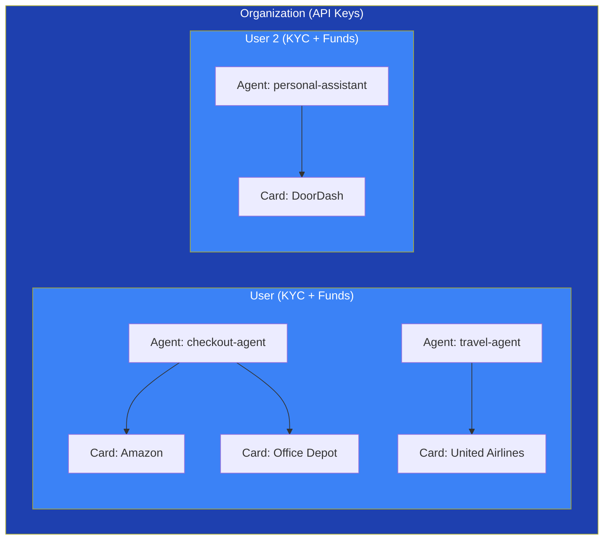
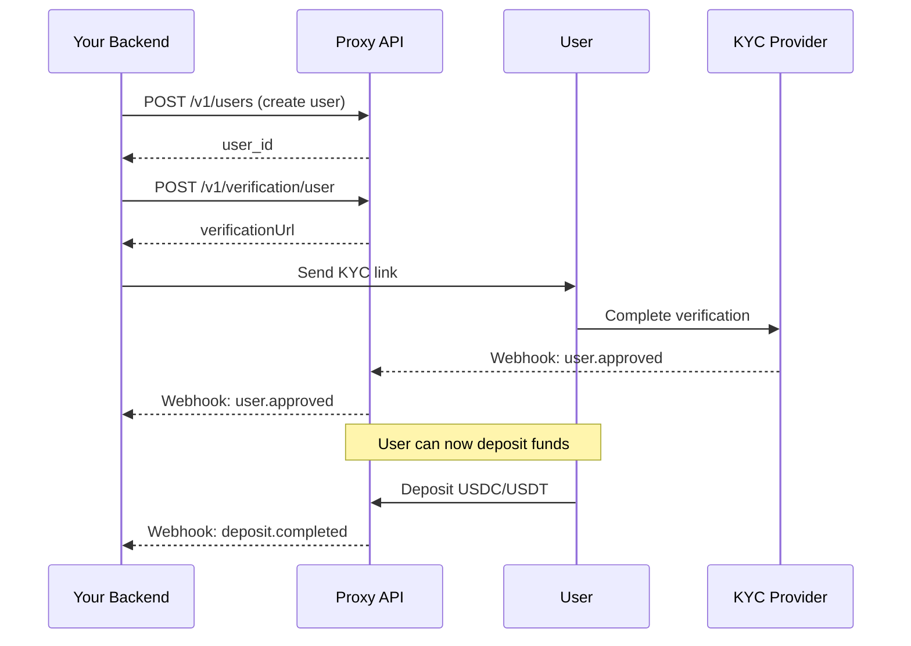
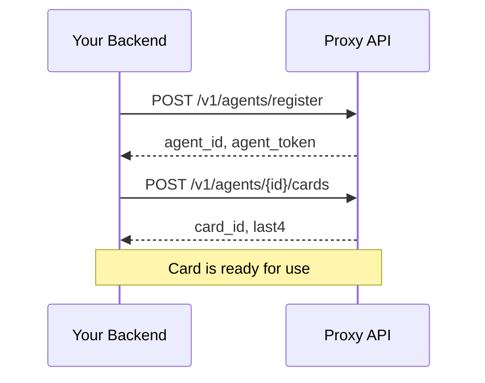
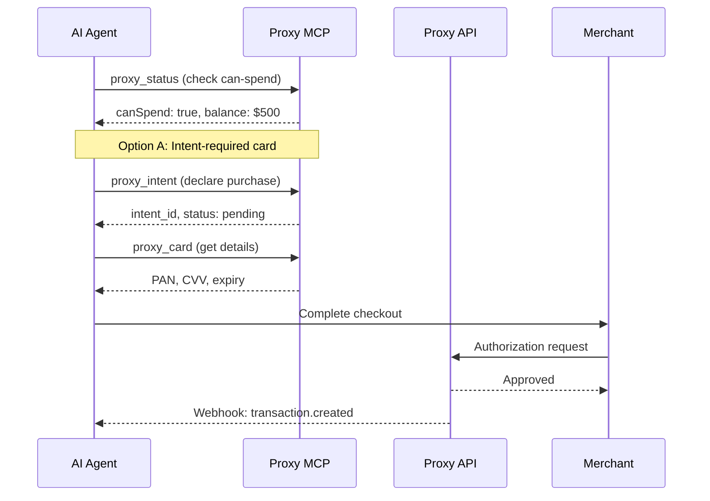
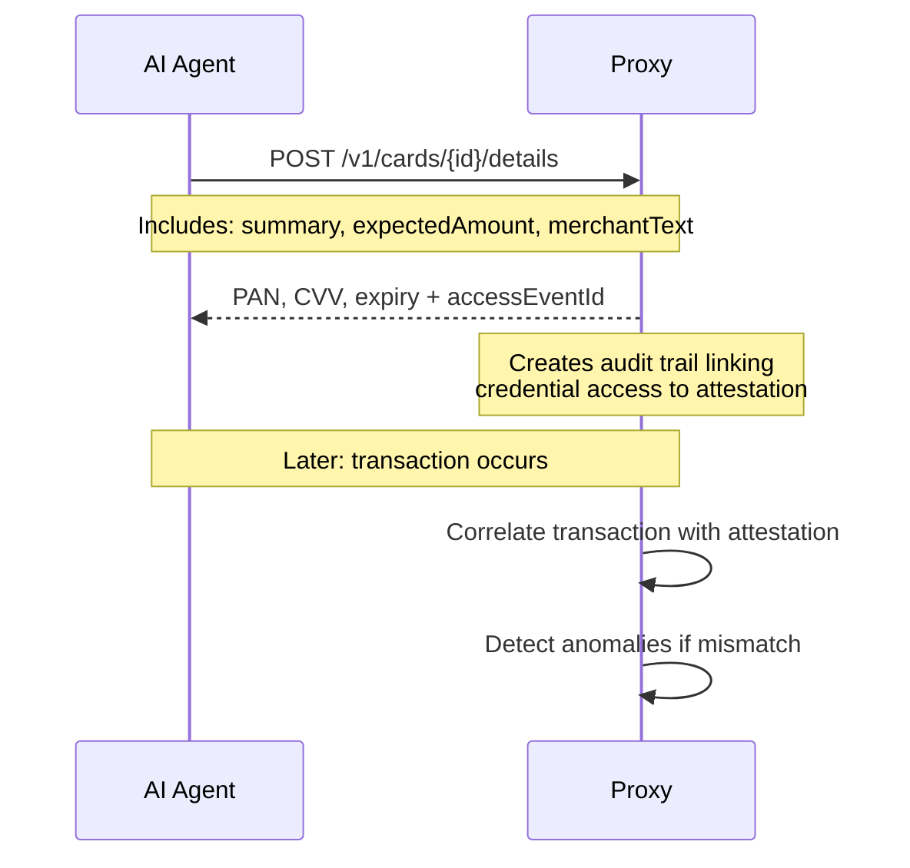

# System Overview

Proxy provides virtual cards designed specifically for AI agents. It creates a secure layer between user funds and agent spending, with built-in controls, audit trails, and anomaly detection.

## Architecture Overview



### Hierarchy

| Level | Description | Example |
|-------|-------------|---------|
| **Organization** | Your company account. Holds API keys. | Acme Corp |
| **User** | Person/entity who funds spending. Must complete KYC. | John Doe (customer) |
| **Agent** | Logical identity that spends. Your AI agent or assistant. | `checkout-agent` |
| **Card** | Virtual card issued to an agent. | Single-use Amazon card |

## Main Workflows

Proxy is built around three main workflows:

### 1. User Onboarding & Funding

Before any spending can happen, a user must be verified and funded:



### 2. Agent & Card Creation

Once a user is verified and funded, register agents and issue cards:



### 3. Spending Flow

When your AI agent needs to make a purchase:



## Core Concepts

### Users vs Agents

| Concept | Who/What | Responsibilities |
|---------|----------|------------------|
| **User** | Person or company that funds spending | KYC verification, deposit funds, set spending limits |
| **Agent** | Your AI agent or assistant | Request cards, declare intents, make purchases |

### Card Types

| Type | Behavior | Use Case |
|------|----------|----------|
| **Single-use** | Auto-closes after one transaction | One-time purchases |
| **Multi-use** | Reusable with velocity limits | Recurring purchases |

### Velocity Limits

Multi-use cards support spending controls to limit agent behavior:

```
Card created → Set limits: $50/transaction, $200/day, $1000/month
            → Transactions within limits → Approved
            → Limits exceeded → Declined
```

Combined with attestation and the risk engine's merchant drift detection, these controls provide comprehensive safety guardrails.

### Security Attestation

Before accessing card credentials, agents must attest what they intend to do:



### Spending Intents

Agents must declare intent before accessing card credentials:

```
1. Create card
2. proxy_card({ action: "details" }) → Error: "Declare intent first"
3. proxy_intent({ action: "declare", summary: "Buy headphones", amount: 9999 })
4. proxy_card({ action: "details" }) → Returns PAN/CVV
5. Transaction completes → Intent marked "matched" or "mismatched"
```

**Intent states:** `pending` → `revealed` → `matched` | `expired` | `mismatched`

## Integration Points

### REST API

Direct HTTP calls for full control:

```bash
curl -X POST https://api.useproxy.ai/v1/agents/agent_xxx/cards \
  -H "Api-Key: lk_live_xxx" \
  -H "Content-Type: application/json" \
  -d '{"purpose": "Buy office supplies", "type": "single", "maxAmount": 10000}'
```

### MCP Server

For AI agents using Claude, Cursor, or other MCP clients:

```json
{
  "mcpServers": {
    "proxy": {
      "command": "npx",
      "args": ["mcp-remote", "https://mcp.useproxy.ai/api/mcp"],
      "env": {
        "PROXY_API_KEY": "lk_live_xxx"
      }
    }
  }
}
```

### Webhooks

Real-time notifications for all events:

- `transaction.created` - New transaction
- `transaction.settled` - Transaction finalized
- `card.frozen` - Card frozen (manual or limit exceeded)
- `user.approved` - KYC completed
- `deposit.completed` - Funds available

## Common Deployment Patterns

<AccordionGroup>
  <Accordion title="Single Company, Multiple Agents">
    Your company is the User. You fund one account, create multiple agents for different workflows.

    ```
    Organization: Acme Corp
      └── User: Acme Corp (your company, $10k deposited)
            ├── Agent: checkout-agent (e-commerce)
            ├── Agent: travel-agent (booking)
            └── Agent: procurement-agent (supplies)
    ```
  </Accordion>

  <Accordion title="Platform with End-User Funding">
    Each of your customers is a User. They fund their own agents.

    ```
    Organization: Your Platform
      ├── User: Customer A ($500 deposited)
      │     └── Agent: customer-a-assistant
      ├── User: Customer B ($1000 deposited)
      │     └── Agent: customer-b-assistant
      └── User: Customer C ($200 deposited)
            └── Agent: customer-c-assistant
    ```
  </Accordion>

  <Accordion title="Hybrid: Company + Customer Funding">
    Some spending is company-funded, some is customer-funded.

    ```
    Organization: Your Platform
      ├── User: Your Company (internal ops)
      │     └── Agent: internal-procurement
      └── User: Customer A (customer-funded)
            └── Agent: customer-a-assistant
    ```
  </Accordion>
</AccordionGroup>

## Next Steps

<CardGroup cols={2}>
  <Card title="Quick Start" icon="rocket" href="/quickstart">
    Create your first card in 5 minutes
  </Card>

  <Card title="Payment Flow" icon="route" href="/payment-flow">
    Detailed walkthrough of the complete payment flow
  </Card>

  <Card title="MCP Integration" icon="plug" href="/mcp/introduction">
    Connect your AI agent via MCP
  </Card>

  <Card title="Best Practices" icon="shield-check" href="/best-practices">
    Security guidelines and recommendations
  </Card>
</CardGroup>
